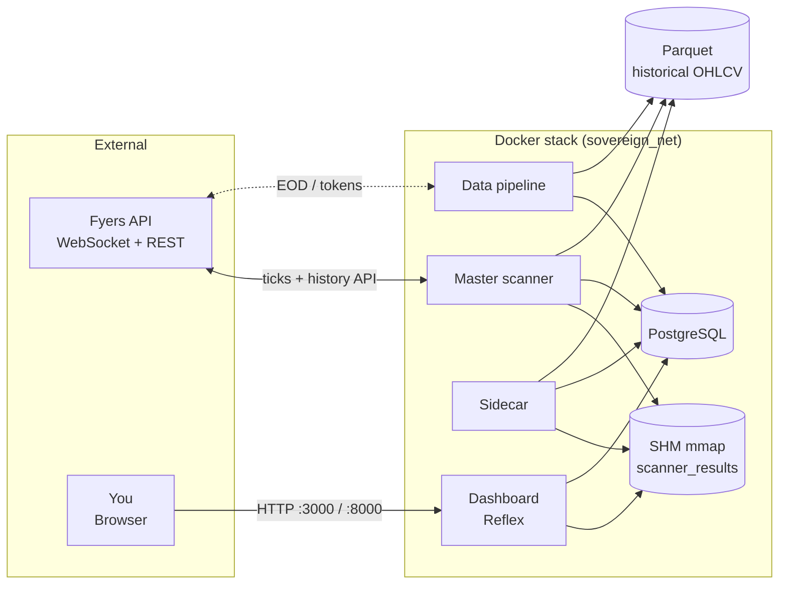
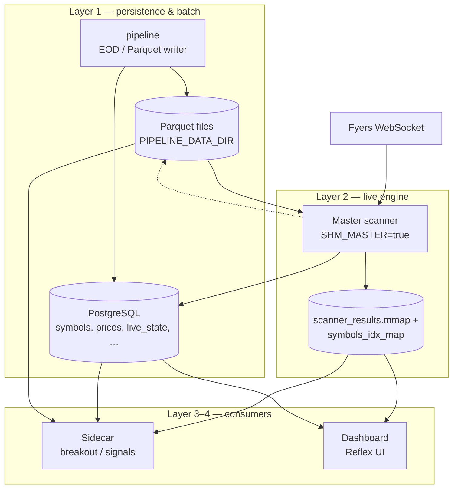
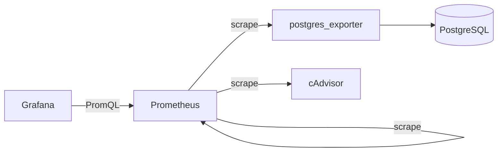

# High-level architecture

One-page view of how services, data stores, and external systems connect. For **calculation ownership** and SHM details, see [`architecture_data_layers.md`](architecture_data_layers.md).

## System context

## Runtime roles (who does what)

## Optional monitoring (`monitoring` Compose profile)

Not required for trading logic; used for infra visibility.

- **Prometheus** scrapes `/metrics` on postgres_exporter, cAdvisor, and itself.
- **Grafana** uses Prometheus as the datasource (provisioned dashboards under `monitoring/grafana/` in the repo root).

---

## Legend

| Symbol | Meaning |
|--------|--------|
| **Master scanner** | Single writer of live math + SHM; Fyers WebSocket feed. |
| **Sidecar** | Reads SHM (slave); strategy / breakout; writes signals to DB. |
| **Dashboard** | Reads SHM + DB; no separate RS engine for “official” numbers. |
| **Pipeline** | Backfill / EOD append to Parquet; DB helpers. |
| **SHM** | Memory-mapped file for low-latency snapshot of scanner results. |
| **Parquet** | Columnar daily history for ring buffers and analytics load. |
